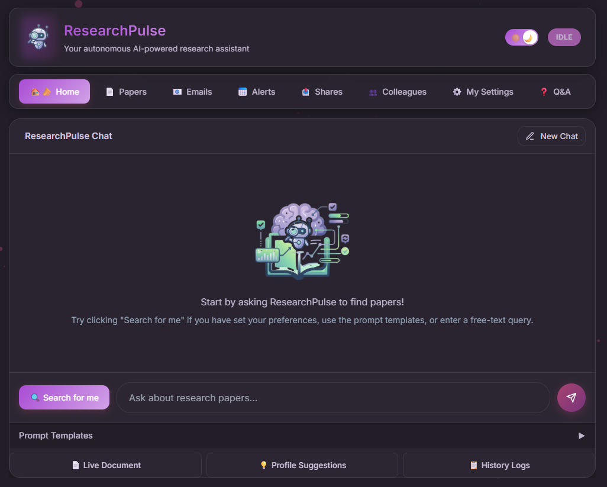

<p align="center">
  
</p>

<h1 align="center">ResearchPulse</h1>

<p align="center">
  <strong>Your Autonomous AI Research Assistant</strong><br/>
  Perceive · Reason · Act - so you never miss a breakthrough paper again.
</p>

<p align="center">
  
  
  
  
  
</p>

---

## 🧠 What is ResearchPulse?

ResearchPulse is an **autonomous AI agent** that helps researchers stay on top of the scientific literature. It continuously scans arXiv, evaluates papers against your personal research profile, and takes intelligent actions - from email digests and calendar reminders to colleague-level paper sharing - all without manual intervention.

Built on a **ReAct (Reasoning + Acting)** agent powered by LangChain, with Pinecone vector search for RAG-based novelty detection, and served through a modern FastAPI + web dashboard.

> [!IMPORTANT]
> ResearchPulse is a **fully autonomous agent**, not a chatbot. It perceives the research landscape, reasons about what matters to *you*, and acts on your behalf - while keeping you in full control via configurable policies and execution settings.

---

## 🏗️ Architecture

<p align="center">
  
</p>

ResearchPulse operates through a three-phase cognitive loop inspired by autonomous agent design:

---

### 👁️ Perception - *"What's new in the world?"*

The agent observes the research landscape by pulling fresh data from external sources:

| Component | What it does |
|-----------|-------------|
| **arXiv API** | Fetches recent papers filtered by your chosen categories and time period. Supports **paper-by-ID** retrieval (e.g. `2301.12345`) and **pagination** to fetch the next batch of unseen papers on re-runs |
| **Pinecone RAG** | Queries the vector store to detect novelty - has this topic been seen before? |
| **Inbox Monitor** | Checks email for colleague replies, reschedule requests, and **autonomous colleague join requests** (join code verified automatically) |
| **Profile Loader** | Reads your research interests, exclusions, and delivery preferences |
| **Delivered Tracker** | Tracks which papers were actually delivered (saved/shared/logged) vs. merely seen, so re-runs fetch genuinely new papers |

> [!NOTE]
> In the current version, perception is **focused** — the agent fetches papers matching your configured arXiv categories and time window, while also drawing context from your user profile, colleague interests, and past feedback stored in the database. This keeps discovery targeted without information overload.

---

### 🧩 Reasoning - *"What matters to the researcher?"*

The LLM-powered ReAct core evaluates every paper through structured thinking:

| Step | Description |
|------|-------------|
| **Relevance Scoring** | Compares each paper's abstract against your research profile using the LLM |
| **Novelty Detection** | Embeds the paper and queries Pinecone - if too similar to past papers, it's deprioritized |
| **Importance Ranking** | Assigns `high` / `medium` / `low` importance based on combined relevance + novelty |
| **Delivery Decision** | Applies your delivery policy to decide: notify, share with a colleague, or just log it |
| **Colleague Filtering** | Papers are shared with colleagues **only** when there is genuine topic or category overlap — high importance alone does not trigger sharing |
| **Stop Policy** | Continuously checks guardrails (max runtime, max papers, max RAG queries) to stay bounded |

The reasoning phase follows the **ReAct pattern**: `Thought → Action → Observation → Thought → ...`, with every step logged for full transparency.

> [!TIP]
> Open the **Live Document** on the Home tab after a run to see the full chain of thoughts and actions the agent took - great for understanding *why* a paper was flagged as important.

---

### ⚡ Action - *"Do something useful."*

Once reasoning is complete, the agent executes real-world actions:

| Action | Trigger | Output |
|--------|---------|--------|
| 📧 **Email Digest** | High-importance paper found | HTML email sent to your inbox |
| 📅 **Calendar Reminder** | Paper worth reading soon | `.ics` file for Google Calendar / Outlook |
| 📤 **Colleague Share** | Paper matches a colleague's interests | Targeted email with paper summary |
| 📨 **Autonomous Colleague Join** | Inbox detects a join-request email with valid code | Colleague auto-added, confirmation email sent |
| ⭐ **Paper Tagging** | Relevance/importance scored | Paper saved with metadata to your library |
| 📝 **AI Summary** | On-demand via dashboard | LLM-generated summary of the full PDF |
| 📑 **Live Document** | After every run | Rolling research briefing with TXT and PDF export |
| 💡 **Profile Evolution** | Patterns detected in your feedback | Deduplicated suggestions to refine your research interests |

> [!NOTE]
> All actions are **auditable**. Every email sent, calendar event created, and share made is logged in the database and visible in the dashboard's Emails, Alerts, and Shares tabs.

---

## 🔀 Autonomous Decision Graph

Unlike a simple linear pipeline, ResearchPulse is a **decision graph** - the agent reaches **25+ autonomous junctions** where it chooses different paths based on context, scores, policies, and feature flags:

<div style="overflow:scroll; max-height:600px; max-width:100%; border:2px solid #d1d5db; border-radius:12px;">
  
</div>

<p align="center">
  <em>↕️ ↔️ Scroll inside the box to navigate · <a href="static/public/decision_graph.svg">Open full-size SVG</a> · <a href="static/public/decision_graph.mmd">Mermaid source</a></em>
</p>

#### 🗺️ Legend

<table>
  <tr>
    <th>Shape / Color</th>
    <th>Meaning</th>
    <th>Example</th>
  </tr>
  <tr>
    <td></td>
    <td><strong>Diamond - Autonomous Decision</strong><br/>Agent evaluates a condition and chooses a path. No human in the loop.</td>
    <td>Scope Gate, Stop Policy, Importance, Digest Mode, Auto-Send</td>
  </tr>
  <tr>
    <td></td>
    <td><strong>Rectangle - Action / Processing</strong><br/>Agent performs a concrete task: fetch, score, send, persist.</td>
    <td>Fetch Papers, Score Relevance, Send Email, Share Paper</td>
  </tr>
  <tr>
    <td></td>
    <td><strong>Rounded - Start / End / Terminate</strong><br/>Entry and exit points of the agent episode.</td>
    <td>Agent Episode Starts, Episode Complete, Terminate</td>
  </tr>
  <tr>
    <td></td>
    <td><strong>Red - HIGH Importance</strong><br/>Triggers email + calendar + reading list.</td>
    <td>HIGH Importance path</td>
  </tr>
  <tr>
    <td></td>
    <td><strong>Amber - MEDIUM Importance</strong><br/>Added to reading list.</td>
    <td>MEDIUM Importance path</td>
  </tr>
  <tr>
    <td></td>
    <td><strong>Green - LOW Importance</strong><br/>Logged only, no actions triggered.</td>
    <td>LOW Importance path</td>
  </tr>
</table>

> [!IMPORTANT]
> Every **diamond** node is an autonomous decision the agent makes on its own - no human in the loop. The agent evaluates each paper independently and chooses a unique combination of actions based on the paper's scores, your delivery policy, and your colleagues' interests. Two papers in the same run can follow completely different paths.

> [!TIP]
> This is **not a chain** - it's a graph with 20+ independent decision junctions per paper. The agent can simultaneously send an email digest, share with a colleague, create a calendar event, *and* suggest a profile update - or do none of those - all based on autonomous reasoning. After each run, four feature-flagged autonomous components (Audit Log, LLM Novelty, Profile Evolution, Live Document) each make their own independent decisions.

---

## ✨ Key Features

| Feature | Description |
|---------|-------------|
| 🤖 **Autonomous Agent** | ReAct loop with bounded execution - no infinite polling |
| 🔍 **Smart Search** | "Search for me" generates queries from your profile automatically |
| 📊 **Relevance + Novelty** | Dual scoring via LLM + Pinecone vector similarity |
| 👥 **Colleague Sharing** | Auto-match papers to colleagues by research interests |
| � **Autonomous Colleague Join** | Colleagues can email the system with a join code to self-register — no manual invite needed |
| �📄 **Paper Summaries** | One-click AI summarization of any paper's PDF |
| 📬 **Inbox Monitoring** | Detects and processes colleague replies |
| 🧬 **Profile Evolution** | Learns from your stars and feedback to improve over time (with duplicate suggestion dedup) |
| 📑 **Live Document** | Rolling research briefing updated after every run, exportable as **TXT** or **PDF** |
| 📥 **CSV Export** | Export your paper library for reference managers |
| 🌓 **Dark / Light Mode** | Theme toggle with persistent preference |
| 🔐 **Join Code Security** | Colleagues need a passphrase to join your network — works via invite link *or* direct email |
| 📈 **Execution Controls** | Max runtime, max papers, min importance - all configurable |
| 🩺 **Health Dashboard** | Real-time status of database, Pinecone, and email connections |

---

## 🖥️ Dashboard Preview

<p align="center">
  <picture>
    <source media="(prefers-color-scheme: dark)" srcset="static/public/dashboard_dark.png" />
    <source media="(prefers-color-scheme: light)" srcset="static/public/dashboard_light.png" />
    
  </picture>
</p>

<p align="center">
  <sub>🌙 Dark mode (default) &nbsp;·&nbsp; ☀️ Light mode available via toggle</sub>
</p>

> [!TIP]
> The dashboard is a full single-page application with 8 tabs - Home, Papers, Emails, Alerts, Shares, Colleagues, Settings, and Q&A. Theme preference is persisted across sessions.

---

## 🚀 Quick Start

### 1. Clone & Install

```bash
git clone <repository-url>
cd ResearchPulse
python -m venv .venv
.venv\Scripts\activate        # Windows
# source .venv/bin/activate   # Linux / macOS
pip install -r requirements.txt
```

### 2. Configure Environment

```bash
copy .env.template .env       # Windows
# cp .env.template .env       # Linux / macOS
```

> [!IMPORTANT]
> You **must** fill in all required API keys in `.env` before starting. The app validates every variable at boot and will refuse to start with a clear error message if anything is missing.

### 3. Initialize Database

```bash
python main.py db-init
```

### 4. Launch

```bash
python main.py
```

Open **http://127.0.0.1:8000** - you'll land on the Home tab. Set up your Research Profile in **My Settings**, then hit **"Search for me"**.

---

## 🔑 Environment Variables

| Variable | Required | Description |
|----------|:--------:|-------------|
| `DATABASE_URL` | ✅ | PostgreSQL (Supabase) connection string |
| `LLM_API_KEY` | ✅ | API key for the LLM service |
| `LLM_API_BASE` | ✅ | Base URL for OpenAI-compatible API |
| `LLM_MODEL_NAME` | ✅ | Model name (e.g. `gpt-4o`) |
| `LLM_PROVIDER` | ✅ | LLM provider identifier (default: `openai`) |
| `PINECONE_API_KEY` | ✅ | Pinecone API key |
| `PINECONE_INDEX_NAME` | ✅ | Pinecone index name |
| `PINECONE_ENVIRONMENT` | ✅ | Pinecone environment / region |
| `EMBEDDING_API_KEY` | ✅ | Embeddings API key |
| `EMBEDDING_API_BASE` | ✅ | Embeddings base URL |
| `EMBEDDING_API_MODEL` | ✅ | Embedding model name |
| `PINECONE_NAMESPACE` | - | Namespace (default: `demo`) |
| `EMBEDDING_API_DIMENSION` | - | Vector dimension (default: `1536`) |
| `APP_HOST` | - | Server host (default: `127.0.0.1`) |
| `APP_PORT` | - | Server port (default: `8000`) |
| `ARXIV_MAX_RESULTS` | - | Max papers per query (default: `50`) |
| `AUDIT_LOG_ENABLED` | - | Enable audit log autonomous component |
| `LLM_NOVELTY_ENABLED` | - | Enable LLM novelty scoring component |
| `PROFILE_EVOLUTION_ENABLED` | - | Enable profile evolution suggestions |
| `LIVE_DOCUMENT_ENABLED` | - | Enable live document generation |

> [!TIP]
> Keep your `.env` file **out of version control**. A `.env.template` is provided with placeholder values for every variable.

---

## 🛡️ Stop Policy & Guardrails

Every run is **bounded** - the agent stops when *any* condition is met:

| Guardrail | Default | Purpose |
|-----------|:-------:|---------|
| Max runtime | 6 min | Prevents runaway execution |
| Max papers checked | 30 | Limits evaluation scope |
| Stop if no new papers | `true` | Exits early when nothing is unseen |
| Max RAG queries | 50 | Caps vector store calls |
| Min importance to act | `medium` | Only important papers trigger actions |

> [!TIP]
> All guardrails are configurable in **My Settings → Execution Settings** on the dashboard.

---

## 📦 Storage Layer

```
┌─────────────────────────────────┐   ┌──────────────────────────────┐
│    PostgreSQL (Supabase)        │   │    Pinecone (Vector Store)   │
│                                 │   │                              │
│  users · papers · paper_views   │   │  Paper embeddings            │
│  colleagues · runs · actions    │   │  Semantic similarity search  │
│  emails · calendar_events       │   │  Novelty detection           │
│  shares · delivery_policies     │   │                              │
└─────────────────────────────────┘   └──────────────────────────────┘
```

> [!NOTE]
> All state lives in PostgreSQL + Pinecone — the app is **deployment-safe** and works identically on local dev, Render, or any cloud host. The arXiv category taxonomy is loaded from the database with a built-in fallback; no local `data/` folder is required.

---

## 🔀 Fetch & Delivery Pipeline

```
User Prompt
    │
    ├─── Contains arXiv ID? (e.g. "2301.12345")
    │       YES → fetch_single_paper → persist as saved → report
    │       NO  ↓
    ├─── Parse prompt → map interests to arXiv categories
    │                     ↓
    ├─── Fetch from arXiv API (with start_index pagination)
    │                     ↓
    ├─── Filter: already-DELIVERED papers removed
    │    (only saved/shared/logged count as delivered;
    │     previously fetched-but-skipped papers reappear)
    │                     ↓
    ├─── For each unseen paper:
    │       Keyword filter → LLM relevance → RAG novelty → Score
    │       Hard relevance gate (≥ 0.20) → Importance ranking
    │                     ↓
    ├─── Enforce output limit (top N by score)
    │                     ↓
    ├─── Colleague surplus: share with colleagues
    │    ONLY when topic OR category overlap exists
    │                     ↓
    ├─── Persist decisions → Generate report
    │                     ↓
    └─── Autonomous components (if enabled):
            • Audit Log
            • LLM Novelty Scoring
            • Profile Evolution (deduped suggestions)
            • Live Document (TXT / PDF export)
```

---

## 📑 Live Document

The **Live Document** is a rolling research briefing maintained after each agent run. It includes an executive summary, top papers, trending topics, and category breakdown.

- Updated automatically from **scored papers only** (not all fetched candidates)
- Viewable on the Home tab
- Exportable as:
  - **Markdown** (default view)
  - **HTML** (rendered in dashboard)
  - **TXT** (plain-text download via `GET /api/live-document?format=txt`)
  - **PDF** (browser print-to-PDF via `GET /api/live-document?format=pdf`)

---

## 💡 Profile Evolution & Suggestions

After each run, the agent analyzes high-scoring papers and generates advisory suggestions:

- **Types**: add/remove/refine topic, add/remove category, merge topics
- **Deduplication**: identical pending suggestions are automatically skipped (same user, type, and text)
- **Category display**: suggestions use human-friendly names like `cs.AI (Artificial Intelligence)` instead of raw codes
- **Advisory only**: suggestions are never auto-applied — user must accept or reject

---

## 👥 Colleague Collaboration & Autonomous Join

ResearchPulse supports a full colleague collaboration workflow with **two ways to join**:

### Manual Invite Flow
1. You add a colleague in the **Colleagues** tab with their name and email
2. They receive a personalized invite email with a secure link
3. They click the link, enter the **Join Code** (set in My Settings), and submit their research interests
4. The agent starts sharing matching papers with them automatically

### Autonomous Email Join Flow
1. You share your **Join Code** privately with a trusted colleague
2. The colleague sends an email directly to the ResearchPulse inbox, mentioning they want to join and including the join code in the message body
3. The **Inbox Monitor** (running on a configurable schedule) detects the join request, validates the code, and automatically adds the colleague
4. A confirmation email is sent — **zero manual action required from the owner**

### Colleague Self-Service
Every colleague also gets **self-service links** in their emails:
- **Update Interests** — update their own research interests and preferred arXiv categories via a personal web form
- **Unsubscribe** — one-click removal from your network at any time

---

## 🖥️ Dashboard Tabs

| Tab | Icon | What you'll find |
|-----|:----:|-----------------|
| **Home** | 🏠 | Auto-growing chat input, "Search for me", Live Document (TXT/PDF export), Profile Suggestions |
| **Papers** | 📄 | Full paper library with star, filter, sort, bulk actions, CSV export |
| **Emails** | 📧 | All sent email digests and colleague notifications |
| **Alerts** | 📅 | Calendar events and reading reminders (.ics download) |
| **Shares** | 📤 | Papers shared with colleagues and delivery status |
| **Colleagues** | 👥 | Manage collaborators, their interests, join codes, and self-service links |
| **My Settings** | ⚙️ | Research profile, execution settings, inbox config, health checks |
| **Q&A** | ❓ | FAQ and help for every feature |

---

## ☁️ Deployment (Render)

### Build Command

```bash
pip install -r requirements.txt && python main.py db-init
```

### Start Command

```bash
python main.py server
```

> [!IMPORTANT]
> Set **all** required environment variables in your Render dashboard before deploying. The app will exit on boot with a clear error if any are missing.

### Render Environment Extras

| Variable | Value |
|----------|-------|
| `ENV` | `production` |
| `APP_HOST` | `0.0.0.0` |

---

## 🧪 Development

### Running Tests

```bash
# Install dev dependencies
pip install -e ".[dev]"

# Unit tests (fast, no external services)
pytest unit_testing/unit/

# All tests including integration
pytest unit_testing/

# With coverage report
pytest unit_testing/ --cov=src --cov-report=html
```

### Code Formatting

```bash
black src/ unit_testing/
isort src/ unit_testing/
```

---

## 📊 Project Structure

```
ResearchPulse/
├── main.py                 # Application entry point
├── requirements.txt        # Python dependencies
├── pyproject.toml          # Build config & metadata
├── alembic.ini             # Database migration config
├── migrations/             # Alembic migration scripts
│   └── versions/           # Individual migrations
├── static/
│   ├── index.html          # Full SPA dashboard (auto-growing chat input)
│   └── public/             # Logo, architecture diagram, decision graph SVG
└── src/
    ├── agent/              # ReAct agent, stop controller, profile evolution, prompt parser
    ├── api/                # FastAPI routes (incl. live-doc TXT/PDF), run manager
    ├── config/             # Feature flags (4 autonomous components)
    ├── db/                 # ORM models, database session, data service, delivered tracking
    ├── rag/                # Pinecone client, embeddings, retriever
    └── tools/              # 20+ LangChain tools (fetch, score, email, live doc, etc.)
```

---

## �️ Database Migrations

Migrations are managed with **Alembic**. Key migrations include:

| Migration | Description |
|-----------|-------------|
| `initial_schema` | Base tables (users, papers, paper_views, colleagues, etc.) |
| `add_arxiv_categories` | ArXiv category taxonomy table |
| `add_autonomous_components` | Audit log, LLM novelty, profile evolution models |
| `add_paper_summary` | Paper AI summary storage |
| `add_paper_view_fields` | Extended paper view tracking (relevance/novelty scores) |
| `add_profile_fields` | Enriched user profile (keywords, time period, stop policy) |
| `add_prompt_templates` | Saved prompt and template management |
| `add_feature_flag_settings` | Feature flag configuration per user |
| `add_execution_settings` | Execution bounds (max runtime, max papers) |

Run pending migrations:

```bash
alembic upgrade head
```

---

## �📜 License

MIT - see [LICENSE](LICENSE) for details.

## 🤝 Contributing

Please read [CODE_OF_CONDUCT.md](CODE_OF_CONDUCT.md) before contributing.

---
