# ResearchPulse: AI Agent System Summary

## Executive Overview

**ResearchPulse** is an autonomous AI agent designed to help researchers stay up-to-date with scientific literature. It monitors arXiv for new papers, evaluates their relevance to the researcher's profile, and takes appropriate actions such as generating email summaries, creating calendar reminders, and sharing discoveries with colleagues.

The system implements the **ReAct (Reasoning + Acting)** pattern using a structured workflow with bounded episodic execution, ensuring predictable resource usage and termination guarantees.

---

## System Architecture

### High-Level Components

| Component | Description |
|-----------|-------------|
| **FastAPI Server** | Web server providing REST API endpoints and serving the chat UI |
| **ReAct Agent** | Core agent implementing the Thought→Action→Observation loop |
| **Stop Controller** | Enforces bounded execution with configurable stop policies |
| **Tool Registry** | Collection of LangChain-style tools the agent can invoke |
| **RAG System** | Pinecone-based retrieval for novelty detection and semantic search |
| **JSON Data Stores** | Lightweight persistence for profiles, papers, and policies |
| **Artifact Generator** | Produces email summaries, calendar events (.ics), and reading lists |

### Architecture Diagram

```mermaid
flowchart TB
    subgraph Client["Client Layer"]
        UI[Web Chat UI<br/>static/index.html]
    end

    subgraph API["API Layer (FastAPI)"]
        Routes["/api/chat<br/>/api/status<br/>/api/health"]
        RunMgr[Run Manager<br/>In-Memory State]
    end

    subgraph Agent["Agent Core"]
        ReAct[ReAct Agent<br/>ResearchReActAgent]
        StopCtrl[Stop Controller<br/>Bounded Execution]
        ToolReg[Tool Registry<br/>8 Registered Tools]
    end

    subgraph Tools["Agent Tools"]
        T1[fetch_arxiv_papers]
        T2[check_seen_papers]
        T3[retrieve_similar_from_pinecone]
        T4[score_relevance_and_importance]
        T5[decide_delivery_action]
        T6[persist_state]
        T7[generate_report]
        T8[terminate_run]
    end

    subgraph External["External Services"]
        ArXiv[(arXiv API)]
        Pinecone[(Pinecone<br/>Vector Store)]
        Embeddings[Embeddings API]
    end

    subgraph Data["Data Layer"]
        Profile[research_profile.json]
        Papers[papers_state.json]
        Colleagues[colleagues.json]
        Policy[delivery_policy.json]
    end

    subgraph Artifacts["Generated Artifacts"]
        Emails[📧 Email Summaries]
        Calendar[📅 Calendar Events .ics]
        ReadList[📋 Reading List]
        Shares[👥 Colleague Shares]
    end

    UI -->|HTTP POST /chat| Routes
    UI -->|HTTP GET /status| Routes
    Routes --> RunMgr
    RunMgr -->|Background Thread| ReAct
    
    ReAct --> StopCtrl
    ReAct --> ToolReg
    ToolReg --> T1 & T2 & T3 & T4 & T5 & T6 & T7 & T8
    
    T1 -->|Query| ArXiv
    T3 -->|Similarity Search| Pinecone
    T3 -->|Generate Embeddings| Embeddings
    T4 -->|Read Profile| Profile
    T2 -->|Check/Update| Papers
    T5 -->|Read| Colleagues
    T5 -->|Read| Policy
    T6 -->|Persist| Papers
    
    T5 -->|Write| Emails
    T5 -->|Write| Calendar
    T5 -->|Write| ReadList
    T5 -->|Write| Shares
```



---

## Agent Workflow

The agent follows a **structured workflow** rather than free-form ReAct reasoning, ensuring predictable and efficient execution:

### Workflow Steps


---

## Core Components Explained

### 1. ReAct Agent (`src/agent/react_agent.py`)

The **ResearchReActAgent** class is the heart of the system. It orchestrates the entire paper discovery workflow:

- **Episode Management**: Each run is an "episode" with a unique `run_id`, tracking all tool calls, decisions, and artifacts
- **Tool Invocation**: Wraps tool calls with timing, logging, and error handling
- **State Accumulation**: Maintains lists of fetched papers, scored papers, decisions, and generated artifacts
- **Stop Condition Checking**: Queries the StopController before and after each major operation

**Key Design Decisions:**
- Uses a **structured workflow** instead of LLM-driven reasoning, ensuring deterministic behavior
- All tool calls are **recorded** for transparency and debugging
- **Graceful error handling** ensures partial progress is preserved

### 2. Stop Controller (`src/agent/stop_controller.py`)

Enforces **bounded episodic execution** through configurable stop policies:

| Stop Condition | Default | Description |
|----------------|---------|-------------|
| `max_runtime_minutes` | 6 | Wall-clock time limit |
| `max_papers_checked` | 30 | Maximum papers to evaluate |
| `stop_if_no_new_papers` | true | Stop if all papers already seen |
| `max_rag_queries` | 50 | Limit RAG API calls |
| `min_importance_to_act` | medium | Minimum importance threshold |

**Stop Reasons:**
- `MAX_RUNTIME_EXCEEDED` - Time limit reached
- `MAX_PAPERS_CHECKED` - Paper quota exhausted
- `NO_NEW_PAPERS` - No unseen papers found
- `MAX_RAG_QUERIES` - RAG query limit reached
- `NO_IMPORTANT_PAPERS` - No paper met importance threshold
- `COMPLETED_SUCCESSFULLY` - Normal completion

### 3. Tool Registry

Eight specialized tools enable the agent's capabilities:

| Tool | Purpose |
|------|---------|
| `fetch_arxiv_papers` | Query arXiv API with category/keyword filters |
| `check_seen_papers` | Compare against papers database to find new papers |
| `retrieve_similar_from_pinecone` | RAG query for novelty/similarity detection |
| `score_relevance_and_importance` | Heuristic scoring: relevance, novelty → importance |
| `decide_delivery_action` | Determine actions based on delivery policy |
| `persist_state` | Save paper decisions to JSON database |
| `generate_report` | Create structured run report |
| `terminate_run` | End the episode cleanly |

### 4. RAG System (`src/rag/`)

The **Retrieval-Augmented Generation** subsystem provides semantic search capabilities:

- **Pinecone Vector Store**: Cloud-hosted vector database for similarity search
- **Embeddings API**: Generates embeddings for papers and queries
- **Retriever**: Returns matches with scores and metadata
- **Novelty Scoring**: High similarity to existing papers = low novelty

**Novelty Calculation:**
```
novelty = 1.0 - (max_similarity × 0.85)
```

### 5. Scoring System (`src/tools/score_relevance.py`)

Papers are scored using a **deterministic heuristic approach**:

**Relevance Score (0-1):**
- Topic keyword overlap (45% weight)
- arXiv category alignment (30% weight)
- Title-specific matches (15% weight)
- Venue bonus (10% weight)
- Avoid-topic penalty (reduces score)

**Importance Levels:**
| Level | Criteria |
|-------|----------|
| **High** | relevance ≥ 0.45 AND novelty ≥ 0.5 |
| **Medium** | relevance ≥ 0.4 OR (relevance ≥ 0.3 AND novelty ≥ 0.6) |
| **Low** | Everything else |

---

## Data Model

### Research Profile (`data/research_profile.json`)

Defines the researcher's preferences:
- `research_topics`: Keywords of interest (e.g., "large language models")
- `avoid_topics`: Topics to filter out (e.g., "cryptocurrency")
- `arxiv_categories_include/exclude`: Category filters
- `my_papers`: Researcher's own publications (for novelty comparison)
- `stop_policy`: Custom stop conditions

### Papers State (`data/papers_state.json`)

Tracks paper decisions:
- Papers seen with timestamps
- Decisions made (saved/shared/ignored/logged)
- Statistics for each category

### Delivery Policy (`data/delivery_policy.json`)

Rules for actions based on importance:
- **High importance**: Email summary + calendar event + reading list
- **Medium importance**: Reading list entry
- **Low importance**: Log only

---

## Generated Artifacts

The agent produces simulated outputs in the `artifacts/` directory:

| Artifact Type | Format | Location |
|--------------|--------|----------|
| Email Summaries | `.txt` | `artifacts/emails/` |
| Calendar Events | `.ics` | `artifacts/calendar/` |
| Reading List | `.md` | `artifacts/reading_list.md` |
| Colleague Shares | `.txt` | `artifacts/shares/` |

---

## API Endpoints

| Endpoint | Method | Description |
|----------|--------|-------------|
| `/api/chat` | POST | Start a new agent run |
| `/api/status?run_id=` | GET | Poll for run status and results |
| `/api/health` | GET | Health check |
| `/` | GET | Serve web UI |
| `/docs` | GET | OpenAPI documentation |

---

## Key Design Principles

1. **Episodic Execution**: Each run is independent, triggered by user, with explicit termination
2. **Bounded Resources**: Stop policies prevent runaway execution
3. **Transparency**: All tool calls and decisions are logged
4. **Graceful Degradation**: System continues working even if external services fail
5. **Deterministic Scoring**: Heuristic-based scoring ensures reproducible results
6. **Modular Tools**: Each tool has a single responsibility and clear interface
7. **Artifact-Based Actions**: Simulated outputs allow demo without real email/calendar integration

---

## Technology Stack

| Layer | Technology |
|-------|------------|
| Web Framework | FastAPI + Uvicorn |
| Agent Pattern | ReAct (custom implementation) |
| Vector Database | Pinecone |
| Embeddings | OpenAI-compatible API |
| Data Storage | JSON files |
| Frontend | Static HTML/JS |
| Validation | Pydantic v2 |

---

## Future Enhancements

- **LLM Integration**: Add optional LLM-based scoring refinement
- **Real Email/Calendar**: Integrate with actual email and calendar APIs
- **Multi-User Support**: Database backend for multiple researchers
- **Continuous Monitoring**: Scheduled runs instead of manual triggers
- **Paper Summarization**: LLM-generated paper summaries
- **Citation Graph Analysis**: Track citation relationships between papers
